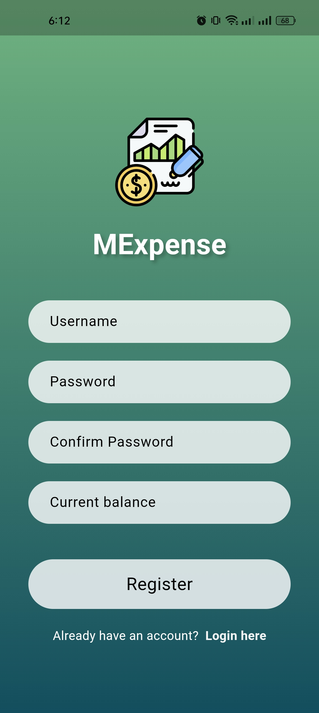
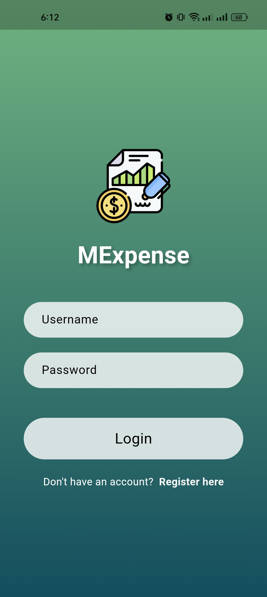
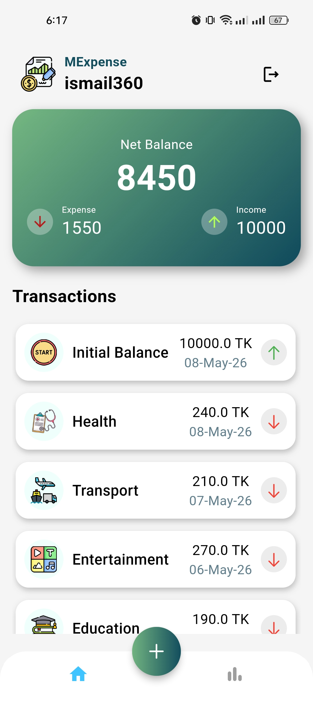

<p align="center">
	
	


</p>
<p align="center">
	<a href="https://github.com/users/CodeWithIsmail/projects/5"></a>
</p>

# MExpense

A robust, offline-first personal finance tracker built with Flutter. MExpense is an offline-first expense tracking application built with Flutter and Dart. It is structured around feature-first modularity, Separation of Concerns, and predictable state flow. The project is engineered for maintainability, scalability, and production-quality code organization.

<p align="center">
	
	
	
</p>

---

## Demo Video

<p align="center">
  <a href="https://youtube.com/shorts/_9q59Zxy3Wk?feature=share">
    
  </a>
</p>

<p align="center">
  🎥 Click the image above to watch the demo video
</p>

---

## UI Screenshots

<p align="center">
  
  
  
</p>

<p align="center">
  
  
  
</p>

---

## Overview

MExpense manages personal finance workflows including authentication, transaction tracking, dashboard summaries, and statistical visualization. The technical focus is on disciplined architecture: clear layering, reusable UI building blocks, and stable local persistence. This architecture matters because it reduces coupling between presentation, state orchestration, and data access, which improves long-term delivery speed and maintainability.

<p align="center">
	
	
	
</p>

---

## Architecture

The codebase follows a Feature-First Layered Architecture.

- core/: Shared cross-feature modules (constants, models, utilities, reusable widgets, services, and database access).
- features/: Vertical feature slices (`auth`, `dashboard`, `stats`) that own their presentation behavior.
- data/: Implemented through `core/database` and `core/services`, responsible for local persistence, session handling, and data operations.
- presentation/: Implemented inside each feature under `presentation/`, responsible for providers, screens, and feature widgets.

Responsibility split:

- UI rendering is handled in feature screens and widgets.
- Reactive state transitions are handled by feature providers.
- Persistence and session concerns are handled by database and service modules.

---

## Project Structure

```txt
lib/
├── main.dart                                 # Application bootstrap, MultiProvider wiring, root MaterialApp
├── core/
│   ├── constants/
│   │   ├── constants.dart                    # Shared app-level constants and theme-related values
│   │   └── data.dart                         # Static domain lists and predefined data used by features
│   ├── database/
│   │   └── database_helper.dart              # SQLite schema, connection lifecycle, and CRUD query methods
│   ├── models/
│   │   ├── app_user.dart                     # User domain model and mapping
│   │   ├── expense.dart                      # Expense domain model and mapping
│   │   └── models.dart                       # Barrel export for model imports
│   ├── services/
│   │   └── auth_service.dart                 # Authentication-oriented service abstraction
│   ├── utils/
│   │   └── helpers.dart                      # Shared styling and utility helpers
│   └── widgets/
│       ├── app_floating_button.dart          # Reusable floating action button component
│       ├── app_logo.dart                     # Reusable branding/logo widget
│       ├── app_text_button.dart              # Shared text-button abstraction
│       ├── app_toast.dart                    # Unified toast feedback helper
│       ├── balance_show_group.dart           # Reusable balance summary UI block
│       ├── custom_text_field.dart            # Shared text field abstraction
│       ├── primary_button.dart               # Shared primary button component
│       └── widgets.dart                      # Barrel export for shared widgets
├── features/
│   ├── auth/
│   │   └── presentation/
│   │       ├── providers/
│   │       │   ├── user_provider.dart        # Auth/session state and user lifecycle management
│   │       │   └── providers.dart            # Barrel export for auth providers
│   │       ├── screens/
│   │       │   ├── login_screen.dart         # Sign-in UI
│   │       │   ├── register_screen.dart      # Registration UI
│   │       │   └── screens.dart              # Barrel export for auth screens
│   │       └── widgets/
│   │           ├── auth_wrapper.dart         # Route-level auth gate and session bootstrap flow
│   │           └── log_or_regi.dart          # Login/register navigation entry widget
│   ├── dashboard/
│   │   └── presentation/
│   │       ├── providers/
│   │       │   ├── expense_provider.dart     # Transaction state, aggregation, and user-scoped sync
│   │       │   └── providers.dart            # Barrel export for dashboard providers
│   │       ├── screens/
│   │       │   ├── add_expense_screen.dart   # Add/edit transaction UI flow
│   │       │   ├── home_screen.dart          # Primary dashboard screen
│   │       │   ├── main_screen.dart          # Main navigation/screen shell
│   │       │   └── screens.dart              # Barrel export for dashboard screens
│   │       └── widgets/
│   │           ├── money_dashboard.dart      # Dashboard summary and analytics widgets
│   │           └── widgets.dart              # Barrel export for dashboard widgets
│   └── stats/
│       └── presentation/
│           ├── screens/
│           │   ├── visualization_screen.dart # Analytics visualization screen
│           │   └── screens.dart              # Barrel export for stats screens
│           └── widgets/
│               ├── category_chart.dart       # Category-wise chart rendering
│               ├── datewise_chart.dart       # Date-range chart rendering
│               └── widgets.dart              # Barrel export for stats widgets
```

---

## Key Engineering Highlights

- Feature-first modular architecture with clear ownership boundaries
- Reusable widget system to reduce duplication and preserve UI consistency
- Theme-driven visual consistency via centralized constants and shared styles
- Shared utility abstraction across features through `core/utils` and `core/widgets`
- Clean Separation of Concerns across presentation, state, and persistence logic
- Scalable reactive state management with Provider and feature-scoped ChangeNotifiers
- SQLite persistence layer with explicit schema design and typed model mapping
- Atomic widget composition for maintainable screen assembly
- Clean folder organization with barrel exports for predictable imports
- Production-oriented structure optimized for iterative feature growth

---

## Features

- Authentication with secure local credential hashing and session restoration
- Transaction management for income/expense create, update, and delete flows
- Dashboard analytics with aggregated balance, income, and expense totals
- Statistics visualization with category and date-wise charting
- Local-first persistence using SQLite and Shared Preferences
- Responsive, modular UI composed from reusable shared components

---

## Tech Stack

- Flutter
- Dart
- Provider
- SQLite (`sqflite`)
- Shared Preferences
- fl_chart
- intl
- crypto

---

## UI & Design Principles

- Reusable widgets in `core/widgets` provide consistent interaction patterns
- Modular UI sections are organized under each feature's `presentation` layer
- Theme consistency is enforced through shared constants and helper styles
- Maintainable styling is centralized to reduce drift across screens
- Pixel-consistent UI behavior is preserved through component reuse instead of per-screen reimplementation

---

## Getting Started

```bash
flutter pub get
flutter run
```

---

## Build Commands

```bash
flutter build apk
flutter build appbundle
flutter build ios
```

---

## Engineering Focus

This project is designed to demonstrate engineering discipline expected in production Flutter systems.

- Clean architecture through strict responsibility boundaries between shared core modules and feature-specific presentation logic
- Scalability through feature-first organization and provider-driven state orchestration
- Maintainability through reusable UI primitives, barrel exports, and centralized utilities
- Modular development workflows that isolate change impact and reduce regression surface
- Reusability through shared components and typed domain models
- Production-grade structure that prioritizes readability, consistency, and long-term extensibility

---

## Future Improvements

- Introduce dependency injection for tighter inversion of control and improved testability
- Expand unit, widget, and integration test coverage for critical paths
- Add optional remote synchronization APIs while preserving offline-first guarantees
